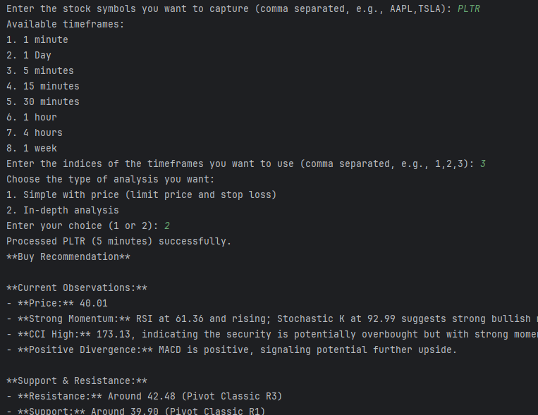

# StockAnalysis

A Python-based tool that captures stock charts, fetches technical indicators, and analyzes market trends using OpenAI's GPT model. This tool leverages TradingView for charting and analysis, allowing users to input stock symbols and timeframes for comprehensive stock analysis.

## Features

- Capture screenshots of TradingView charts for multiple stock symbols.
- Fetch technical indicator readings using the `tradingview-ta` library.
- Send images and indicator data to OpenAI's GPT for analysis.
- Save screenshots, indicators, and API responses in specified directories.
## Example Output
The following is an example of the output generated by the tool, showing a sample analysis for the stock symbol PLTR:

## Prerequisites

- Python 3.7 or higher
- Pip (Python package installer)
- A valid OpenAI API key
- Chrome browser installed

## Installation

1. **Clone the repository:**

   ```bash
   git clone https://github.com/yourusername/stock-analysis-tool.git
   cd stock-analysis-tool
   ```

2. **Install required packages:**

   You can install the necessary dependencies using pip:

   ```bash
   pip install -r requirements.txt
   ```

3. **Set up your API key:**

   Replace `"your api"` in the script with your actual OpenAI API key.

4. **Modify Chrome executable path:**

   Ensure the path to the Chrome executable is correctly set in the script (`chrome_executable_path`).

## Usage

1. **Run the script:**

   Execute the script using Python:

   ```bash
   python your_script_name.py
   ```

2. **Input the stock symbols:**

   When prompted, enter the stock symbols you wish to analyze, separated by commas (e.g., `AAPL,TSLA`).

3. **Select timeframes:**

   Choose the timeframes you want to analyze by entering the corresponding indices.

4. **Review the results:**

   The tool will save screenshots, technical indicators, and OpenAI analysis responses in the specified directories (`screenshots` and `indicators`).

## Directory Structure

```
.
├── screenshots/           # Directory for saved screenshots
├── indicators/            # Directory for saved indicator readings
├── exchange_info.json     # JSON file containing exchange information
├── requirements.txt       # List of dependencies
└── AIStock.py    # Main script file
```

## License

This project is licensed under the MIT License - see the [LICENSE](LICENSE) file for details.

## Acknowledgments

- [TradingView](https://www.tradingview.com/)
- [OpenAI](https://www.openai.com/)
- [Pyppeteer](https://github.com/pyppeteer/pyppeteer)
- [Pillow](https://pillow.readthedocs.io/en/stable/)
- [tradingview-ta](https://pypi.org/project/tradingview-ta/)

## Contributing

Contributions are welcome! Please open an issue or submit a pull request.

## Contact

For questions or feedback, please contact:

- **Your Name**
- **Email: your.email@example.com**
